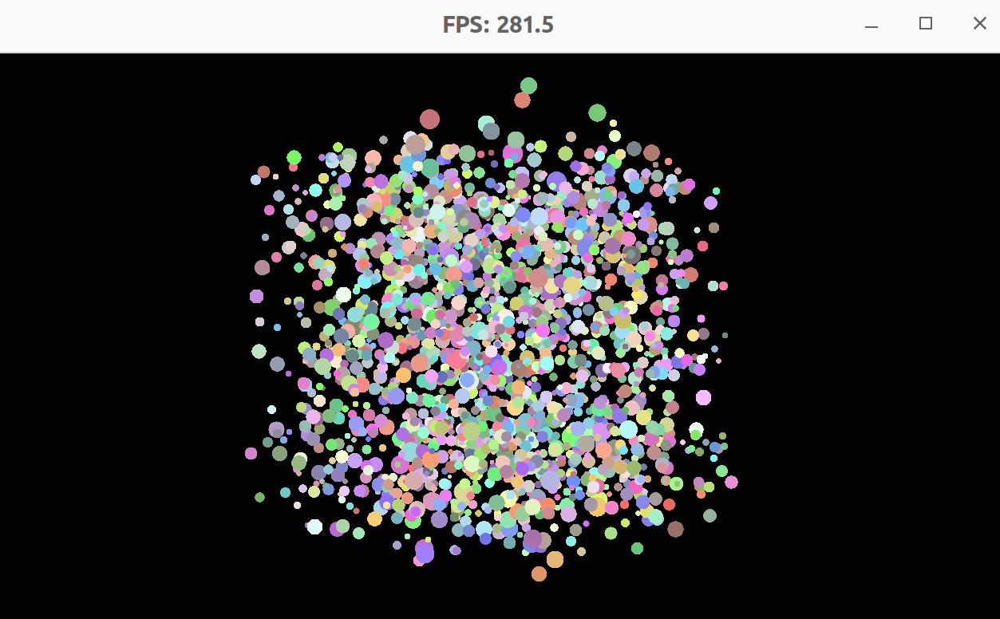

## Build & Run
```bash
git clone https://github.com/denniskb/hiring_test.git
cd hiring_test
git submodule update --init --recursive
mkdir build
cd build
cmake -DCMAKE_BUILD_TYPE=Release ..
make
./hiring_test
```

## Requirements
- OpenGL + FreeGlut
- Only tested on Linux/GCC (but should work cross-platform)

## Assignment
There are several issues with the code:
- The spheres are not rendered perspectively correctly, only approximatively.
- There is no depth buffering.

Beyond fixing those you should *maximize the performance* of the renderer.
As a bonus, add simple shading. The `render()` function should be
a good starting point for your edits but feel free to change anything you like/see fit.
